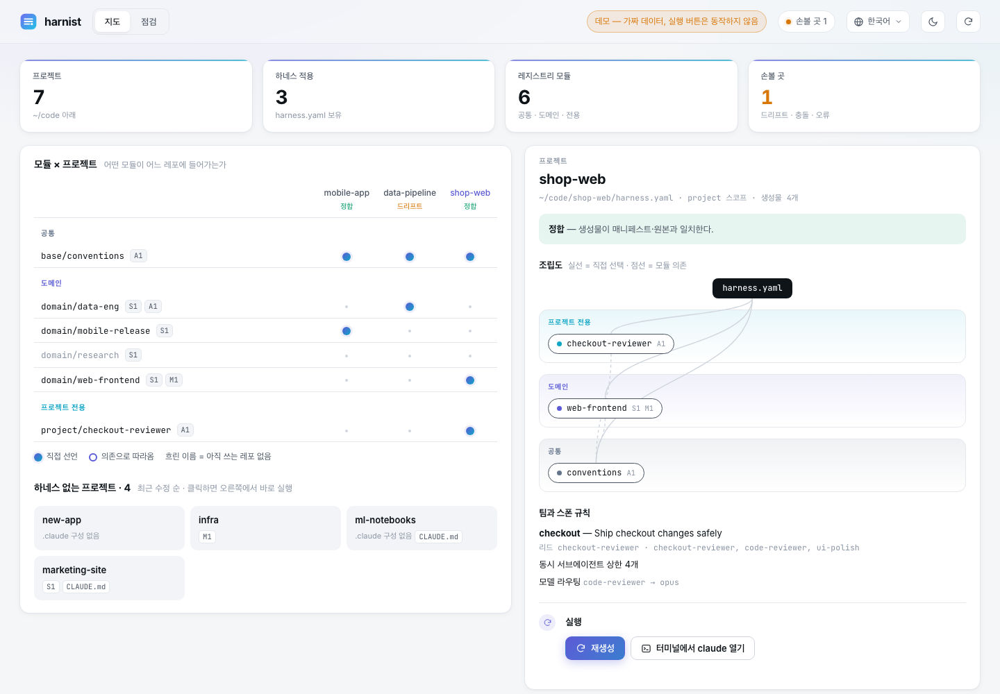
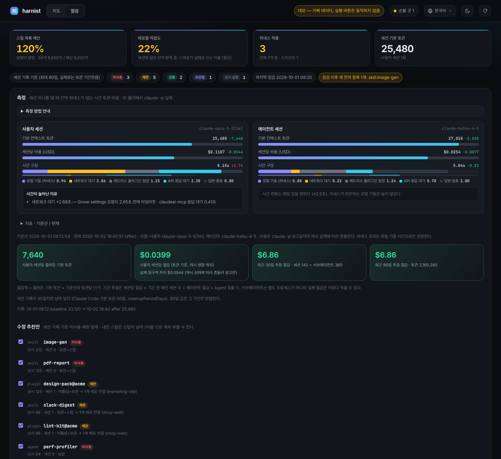
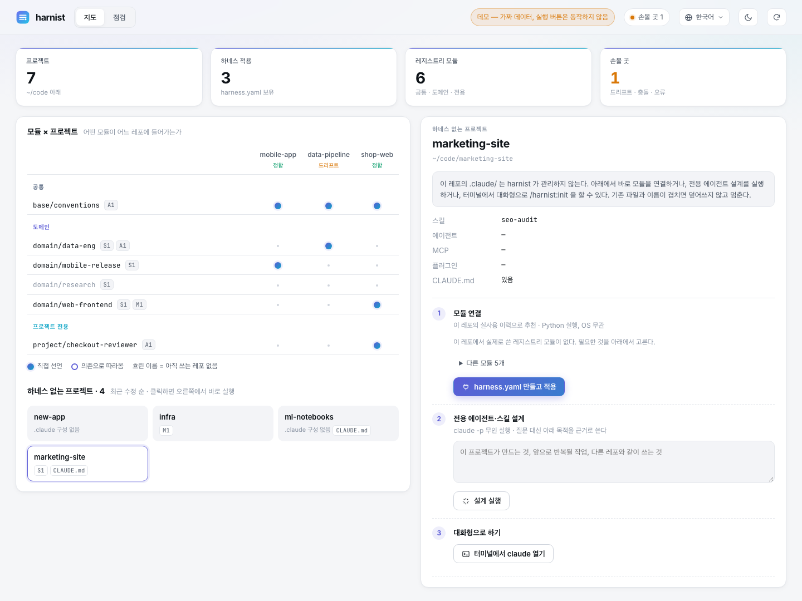

<div align="center">

# harnist

**프로젝트마다 맞는 스킬·플러그인·MCP를, 설명이 잘리지 않게.**

[Claude Code](https://claude.com/claude-code) 하네스를 위한 Tuist식 모듈 관리 도구이자 대시보드입니다.

[English](README.md) · [빠른 시작](#빠른-시작) · [기능](#기능) · [동작 방식](#동작-방식)



</div>

## 왜 만들었나

전역에 설치한 스킬·에이전트·플러그인·MCP는 그 레포에 필요하든 아니든 **모든** Claude Code 세션에 함께 실립니다. 그래서 세 가지 문제가 생깁니다.

- **스킬 설명이 잘립니다.** Claude Code는 모델에게 보여줄 스킬 목록에 예산을 둡니다. 예산을 넘으면 설명을 자르기 때문에, 모델이 엉뚱한 스킬을 고르거나 맞는 스킬을 놓칩니다. 로그에는 `Skill listing over budget`으로 찍힙니다. 만든 사람의 환경에서는 스킬 89개, 33,688자가 예산 8,000자를 넘고 있었습니다.
- **실린 것 대부분이 그 레포와 무관합니다.** 레포 17개를 보면, 세션이 싣고 다니는 전역 항목 중 그 레포가 실제로 쓰는 건 평균 4개 중 1개였습니다.
- **사본이 원본과 어긋납니다.** 한 레포에서 `~/.claude`로 손으로 복사해 올린 스킬은 시간이 지나면 원본과 달라집니다.

harnist는 하네스를 모듈화된 코드베이스처럼 다룹니다. 공유할 것은 **레지스트리**에 모듈로 두고, 레포는 필요한 것을 `harness.yaml`에 선언합니다. `.claude/`는 **생성물**이 됩니다. 대시보드는 레포마다 실제로 쓰는 것을 보여주고, 전역에서 내릴 것을 추천하고, 그 효과를 측정합니다.

토큰과 비용 절감은 따라오는 결과일 뿐, 목적은 아닙니다.

## 빠른 시작

```bash
git clone https://github.com/Dominic-DK/harnist && cd harnist
pip install pyyaml            # 의존성은 이것 하나 (또는 uv run harnist.py ...)
python3 harnist.py demo --open
```

`demo`는 임시 폴더에 가짜 작업 공간을 만들고, 대시보드를 읽기 전용으로 엽니다. 가짜 작업 공간에는 프로젝트, 레지스트리, 전역 `~/.claude`, 세션 기록, 측정 기록이 들어 있습니다. 내 환경은 건드리지 않습니다.

실제로 쓸 때는 이렇게 띄웁니다.

```bash
python3 harnist.py view --open      # ~/Documents/github 아래 레포 (HARNIST_ROOT 로 변경)
```

처음 `view`를 띄우면 기준선 측정을 한 번 합니다. `claude -p`를 두 번 실행하며, 자세한 내용은 [측정](#측정)에 있습니다.

### Claude Code 플러그인으로 쓰기

이 레포는 그 자체로 플러그인 마켓플레이스입니다.

```
/plugin marketplace add Dominic-DK/harnist
/plugin install harnist@harnist
```

설치하면 슬래시 명령(`/harnist:audit`, `/harnist:init`, `/harnist:sync`, `/harnist:promote`, `/harnist:view`)과 작은 SessionStart 훅이 생깁니다.

- **명령**: 사용자가 부를 때만 로드되므로 **상시 컨텍스트 비용이 0**입니다.
- **훅**: 알릴 게 있을 때만 말하고, 헤드리스·SDK 실행에서는 아무것도 하지 않습니다.
- **엔진**: 마켓플레이스 클론에서 실행되므로 따로 받을 필요가 없습니다.

## 기능

### 지도 — 무엇이 어디에 들어가나

**모듈 × 프로젝트** 매트릭스가 레포마다 어떤 모듈을 쓰는지 보여줍니다. 채운 점은 직접 선언, 빈 원은 의존으로 따라온 모듈입니다. 프로젝트를 누르면 계층 조립도(전용 → 도메인 → 공통), 팀, 스폰 규칙이 보입니다. `harness.yaml`이 없는 레포는 아래에 따로 나옵니다.

### 점검 — 실사용 기준으로 전역을 줄인다



Claude Code 세션 기록(`~/.claude/projects/*.jsonl`)을 읽어, 레포마다 어떤 스킬·에이전트·플러그인·MCP를 실제로 호출했는지 셉니다. 전역 항목마다 판정이 붙습니다.

| 판정 | 뜻 | 제안 |
| --- | --- | --- |
| 미사용 | 한 번도 호출되지 않음 | 레지스트리에 보관하고 전역에서 뗀다 |
| 제한 | 1~2개 레포에서만 씀 | 보관하고 그 레포에만 연결한다 |
| 공통 | 3개 이상 레포에서 씀 | 전역 유지 |
| 보관됨 | 이미 내렸고 스텁이 남음 | — |

추천안을 체크하고 **선택 항목 적용 후 재측정**을 누르면 됩니다. 아무것도 지우지 않습니다.

- **스킬**: `~/.claude/skills/<이름>`에 상시 비용 0인 **스텁**이 남습니다. 그래서 `/이름`은 그대로 동작합니다. 부르면 보관본을 읽어 수행하고, 이 레포에 연결할지 전역으로 되돌릴지 묻습니다.
- **원본**: `.trash/`로 옮겨 둡니다.
- **플러그인·MCP**: 플러그인은 사용자 스코프에서 비활성화하고, MCP는 설정을 모듈에 보관한 뒤 사용자 스코프에서 제거합니다.

맨 위 타일이 핵심 지표입니다.

- **스킬 목록 예산**: 모델이 설명을 온전히 보고 있는가
- **레포별 적합도**: 실린 전역 항목 중 레포가 실제로 쓰는 비율
- **하네스 적용 프로젝트**: 관리되는 레포 수와 드리프트 수
- **세션 기본 토큰**

### 측정

빈 폴더에서 `claude -p`를 사용자 세션(설정 기본 모델)과 에이전트 세션(haiku)으로 한 번씩 실행해, 전역 부담만 잽니다. 시간은 디버그 로그로 다섯 구간으로 나눕니다.

| 구간 | 내용 |
| --- | --- |
| 로컬 기동 | 설정·플러그인·훅·로컬 MCP — 하네스가 좌우하는 유일한 구간 |
| 네트워크 대기 | 계정 설정·커넥터 같은 원격 요청 |
| 헤드리스 플러그인 점검 | `claude -p`에서만 실행 |
| API 응답 대기 | 서버 속도 |
| 답변·종료 | 출력 길이 |

기준선보다 느려진 구간에는 로그에서 찾은 원인이 붙습니다. 예를 들어 *"Grove settings 요청이 2.65초 만에 타임아웃"*처럼요. 그래서 네트워크 잡음을 하네스 탓으로 오해하지 않습니다.

절감액은 실제 청구액 차이가 아니라 *줄어든 기본 토큰 × 기준선의 토큰당 단가*로 계산합니다. 측정을 연달아 하면 캐시가 데워져서 청구액이 실제보다 많이 줄어 보이기 때문입니다.

### 새 프로젝트 — 실제로 쓸 것만 연결



하네스가 없는 레포를 고르면 오른쪽 패널에 세 단계가 나옵니다.

1. **모듈 연결**: 그 레포의 실사용 이력으로 레지스트리 모듈을 추천합니다. 전역에 이미 켜져 있는 건 빼고요. 적용하면 `harness.yaml`을 쓰고 `.claude/`까지 생성합니다. 순수 Python이라 OS와 무관합니다.
2. **전용 에이전트·스킬 설계**: 목적을 적으면 `claude -p`가 `/harnist:init` 절차를 무인으로 실행합니다. 어떤 모듈도 덮지 못하는 것만 설계해 `.harnist/modules/`에 프로젝트 모듈로 남기고, 진행 로그를 패널로 흘려보냅니다.
3. **대화형으로 하기**: 그 폴더에서 `claude`를 띄운 터미널을 엽니다. macOS는 Terminal, Windows는 Windows Terminal이나 cmd, Linux는 흔히 쓰는 터미널 중 있는 것을 씁니다. 열 수 없으면 복사할 명령을 보여줍니다.

### 10개 언어

English, 한국어, 日本語, 中文, Español, Français, Русский, हिन्दी, Deutsch, Português를 지원합니다. 오른쪽 위 메뉴에서 고르거나 `?lang=ja`처럼 주소로 지정할 수 있습니다.

## 동작 방식

```
registry/                          공유 모듈 (개인 데이터 — gitignore, 또는 ~/.harnist/registry)
  base/conventions/module.yaml     layer: base | domain | project
  domain/web-frontend/module.yaml  skills, agents, plugins, mcp, settings, claude_md, rewrites
<레포>/harness.yaml                 이 레포가 쓰는 모듈 (+ 스폰 규칙, 팀, mirror)
<레포>/.harnist/modules/project/    프로젝트 전용 모듈 — 레지스트리로 승격 가능
<레포>/.claude/  CLAUDE.md 블록      생성물 — 손으로 고치지 않는다
```

| Tuist | harnist |
| --- | --- |
| `Project.swift` | `harness.yaml` |
| 모듈과 계층 규칙 | `registry/<계층>/<이름>/module.yaml`. 하위 계층은 상위 계층에 의존하지 못한다 |
| `tuist generate` | `harnist generate` → `.claude/`, `.mcp.json`, `CLAUDE.md` 관리 블록 |
| `Package.resolved` | `harness.lock` — 모듈 내용 해시와 마켓플레이스 커밋 |
| `tuist graph` | `harnist graph`와 대시보드 |

모듈은 다른 레포의 `.claude/`를 `source`로 가리킬 수 있습니다. 그래서 원본이 계속 유일한 기준으로 남고, harnist는 그것을 경로를 고쳐 복사합니다. `mirror: [AGENTS.md]`를 두면 `.claude/`를 읽지 않는 에이전트(예: Codex)에게도 같은 규칙 블록을 씁니다.

### 안전장치

- 생성한 파일은 모두 장부에 해시로 기록합니다. harnist가 만들지 않은 파일(`--adopt`로 편입)이나 손으로 고친 파일(`--force`)은 덮어쓰지 않고, 충돌이 하나라도 있으면 아무것도 쓰지 않습니다.
- `CLAUDE.md`는 줄 단독으로 놓인 `<!-- harnist:begin -->`과 `<!-- harnist:end -->` 사이만 건드립니다.
- 심볼릭 링크 너머에는 쓰지 않습니다. 예를 들어 다른 에이전트와 공유하는 `~/.claude/skills/x → ~/.agents/skills/x` 같은 경우입니다. `links: skip`으로 그쪽 도구에 맡길 수 있습니다.
- 보관할 때 비밀값으로 보이는 내용은 거부하고, `.env`나 키 파일은 복사에서 뺍니다. `env`나 `headers`가 있는 MCP 설정은 직접 옮겨야 합니다.
- 대시보드는 `127.0.0.1`에만 열리고, `Host` 헤더를 검사하며, 모든 실행 요청에 실행마다 새로 만드는 토큰을 요구합니다.

## CLI

```
harnist demo [--open]                             가짜 작업 공간, 읽기 전용 대시보드
harnist view [--open] [--no-baseline]             내 레포 대시보드
harnist list | scan                               레지스트리 모듈 · 레포별 모듈 사용
harnist init [dir] --modules base/... domain/...  새 harness.yaml
harnist generate [-m harness.yaml] [--dry-run] [--frozen] [--adopt] [--force]
harnist check                                     드리프트·락 검사 (어긋나면 exit 1)
harnist attach|detach <모듈> [레포]
harnist promote project/<x> --to domain/<x>       프로젝트 모듈 → 공유 레지스트리
harnist usage [--json]                            전역 항목의 레포별 실사용
harnist demote skill:<x> --to domain/<x> [--attach 레포 ...] [--dry-run]
harnist recall skill:<x> --attach . | --global    보관한 스킬 되살리기
harnist bench                                     기동 시간·기본 토큰·비용 측정
harnist audit [--mark]                            현재 전역 상태를 점검 완료로 기록
```

## 호환성

| | macOS | Linux | Windows |
| --- | --- | --- | --- |
| 엔진·대시보드·모듈 적용 | ✓ | ✓ | ✓ (Python 3.10+, pyyaml) |
| `claude -p` 설계·측정 | ✓ | ✓ | ✓ (claude CLI 필요) |
| 터미널 열기 | Terminal | 있는 터미널 순서대로 | wt 또는 cmd |
| SessionStart 훅 | `sh` 런처가 python3·python·py 중 있는 것 사용 | 같음 | Claude Code가 Git Bash로 훅 실행 |

## 한계

- 스폰 규칙 중 모델 라우팅 외의 것은 `CLAUDE.md`에 들어가는 프롬프트 문장이라 강제되지 않습니다.
- 락은 마켓플레이스 변화를 감지만 하고, 플러그인 버전을 고정하지는 못합니다.
- 사용 집계는 남아 있는 세션 기록 속 명시적 호출만 셉니다. Claude Code는 기본 30일만 보관합니다(`cleanupPeriodDays`).
- 헤드리스 실행은 `CLAUDE_CODE_SESSION_ATTENDED`와 `CLAUDE_CODE_ENTRYPOINT`로 구분합니다. 공식 문서에 있는 값이 아니라 실측으로 확인한 값입니다.

## 개발

```bash
python3 -m unittest tests.test_harnist      # 테스트 50개
python3 harnist.py demo --dir /tmp/harnist-demo
```

## 라이선스

MIT
