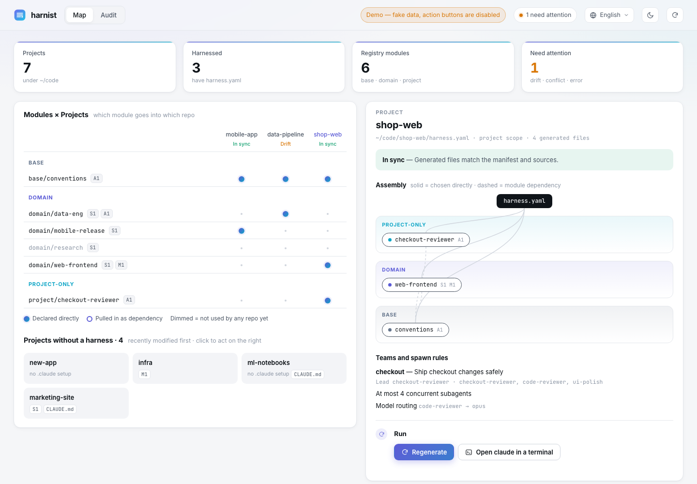
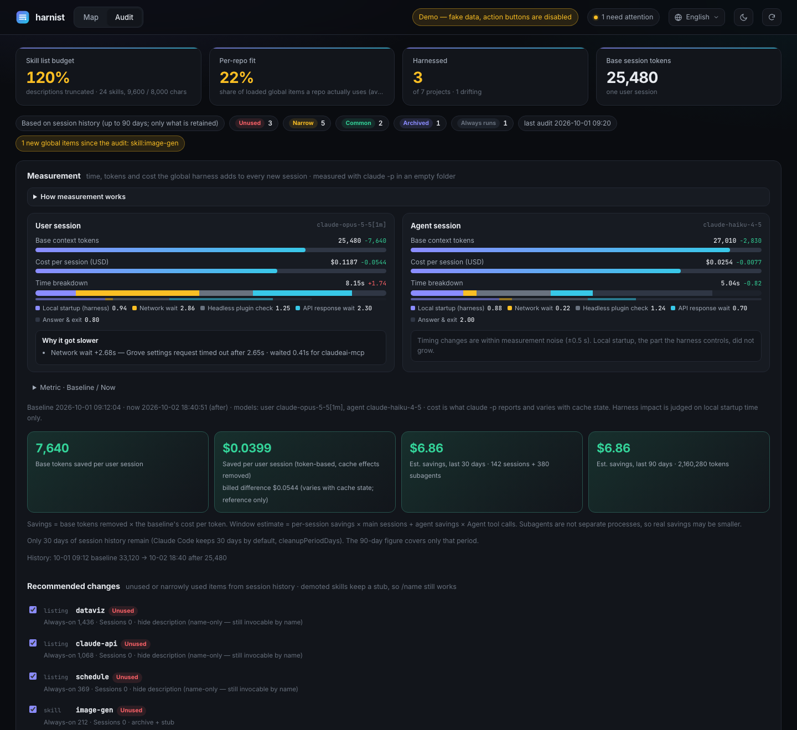
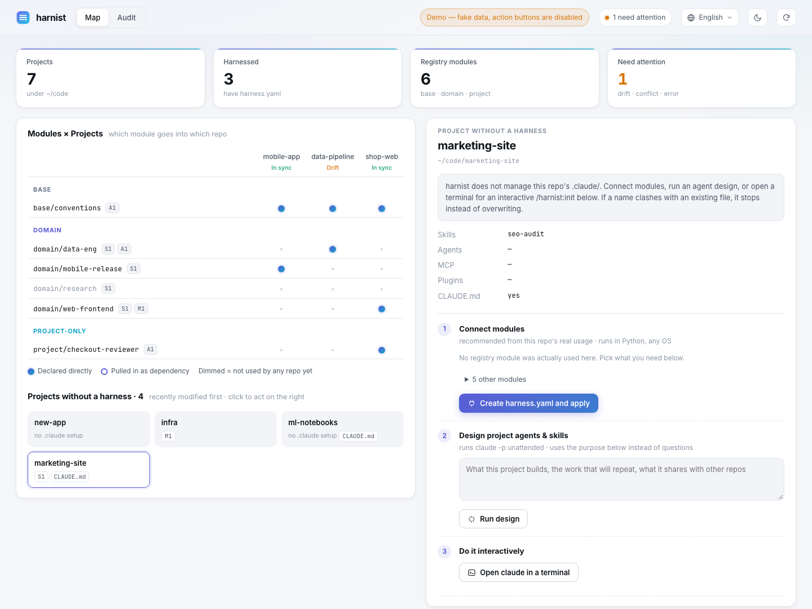

<div align="center">

# harnist

**The right skills, plugins and MCP servers for each project — with nothing truncated.**

A Tuist-style module manager and dashboard for [Claude Code](https://claude.com/claude-code) harnesses.

[한국어](README.ko.md) · [Quick start](#quick-start) · [Features](#features) · [How it works](#how-it-works)



</div>

## Why

Every global skill, agent, plugin and MCP server you install rides along in **every** Claude Code session, whether or not that repo needs it. Three problems follow:

- **Skill descriptions get truncated.** Claude Code budgets the skill list it shows the model. Past the budget it cuts descriptions, so the model picks the wrong skill or misses the right one. Claude Code logs this as `Skill listing over budget` — on the author's machine it was 89 skills and 33,688 characters against an 8,000-character budget.
- **Most of what is loaded is irrelevant.** Across 17 repos, a session used on average only 1 in 4 of the global items it carried.
- **Copies drift.** Skills promoted from one repo to `~/.claude` by hand slowly diverge from their source.

harnist treats your harness like a modular codebase. Shared things live in a **registry** as modules, each repo declares what it needs in a `harness.yaml`, and `.claude/` is **generated**. A dashboard shows what every repo actually uses, recommends what to move out of the global scope, and measures the effect.

Token and cost savings come along, but they are the side effect, not the point.

## Quick start

```bash
git clone https://github.com/Dominic-DK/harnist && cd harnist
pip install pyyaml            # the only dependency (or: uv run harnist.py ...)
python3 harnist.py demo --open
```

`demo` builds a fake workspace in a temp folder — projects, a registry, a global `~/.claude`, session history and measurements — and opens the dashboard read-only. Nothing on your machine is touched.

To use it for real:

```bash
python3 harnist.py view --open      # your repos under ~/Documents/github (HARNIST_ROOT to change)
```

The first `view` runs one baseline measurement (two `claude -p` calls, see [Measurement](#measurement)).

### As a Claude Code plugin

This repository is also a plugin marketplace:

```
/plugin marketplace add Dominic-DK/harnist
/plugin install harnist@harnist
```

The plugin adds slash commands — `/harnist:audit`, `/harnist:init`, `/harnist:sync`, `/harnist:promote`, `/harnist:view` — and a tiny SessionStart hook. The commands are user-invoked only, so they add **no always-on context**. The hook stays silent unless something needs attention, and does nothing in headless or SDK runs. The engine runs from the marketplace clone, so no separate checkout is needed.

## Features

### Map — what goes where

The **Modules × Projects** matrix shows which module each repo uses: a filled dot means declared directly, a ring means pulled in as a dependency. Click a project to see its layered assembly (project → domain → base), teams and spawn rules. Repos without a `harness.yaml` are listed underneath.

### Audit — slim the global scope by real usage



harnist reads your Claude Code session history (`~/.claude/projects/*.jsonl`) and counts which skills, agents, plugins and MCP servers each repo actually called. Every global item gets a verdict:

| Verdict | Meaning | Suggested action |
| --- | --- | --- |
| Unused | never called | archive to the registry, remove from global |
| Narrow | used in 1–2 repos | archive and connect only to those repos |
| Common | used in 3+ repos | keep global |
| Archived | already moved out, a stub remains | — |

Tick the recommendations and press **Apply selected and re-measure**. Archiving never deletes anything:

- **Skills** leave a **stub** in `~/.claude/skills/<name>` with zero always-on cost. `/name` still works: the stub loads the archived copy and offers to connect it to the current repo or restore it globally.
- **Originals** go to `.trash/`.
- **Plugins** are disabled at user scope. **MCP servers** are removed at user scope, with their config kept in a module.

The top tiles are the numbers that matter:

- **Skill list budget**: is the model seeing full descriptions?
- **Per-repo fit**: the share of loaded global items each repo actually uses.
- **Harnessed projects**: how many repos are managed, and how many are drifting.
- **Base session tokens**

### Measurement

`claude -p` runs once as a user session (your default model) and once as an agent session (haiku) in an empty folder, so only the global load is measured. The debug log splits time into five segments:

| Segment | What it covers |
| --- | --- |
| Local startup | settings, plugins, hooks, local MCP — the only part the harness controls |
| Network wait | remote requests such as account settings and connectors |
| Headless plugin check | runs only under `claude -p` |
| API response wait | server speed |
| Answer & exit | output length |

When a segment gets slower than the baseline, the cause found in the log is shown (for example *“Grove settings request timed out after 2.65 s”*), so network noise is never mistaken for a harness regression.

Savings are computed as *base tokens removed × the baseline's cost per token*, not as the billed difference, because back-to-back runs warm the cache and make billed costs look lower than they are.

### New projects — connect what you will actually use



For a repo without a harness, the right-hand panel offers three steps:

1. **Connect modules.** harnist recommends registry modules from that repo's real usage and skips anything already enabled globally. Applying writes `harness.yaml` and generates `.claude/`. This step is pure Python and works on any OS.
2. **Design project agents & skills.** Describe the project and harnist runs `claude -p` unattended with the `/harnist:init` procedure. It designs only what no module covers, stores the result as project modules in `.harnist/modules/`, and streams the log into the panel.
3. **Do it interactively.** Opens a terminal with `claude` in that folder: Terminal on macOS, Windows Terminal or cmd on Windows, and the usual emulators on Linux. If none can be opened, it shows the command to copy.

### Ten languages

The dashboard speaks English, 한국어, 日本語, 中文, Español, Français, Русский, हिन्दी, Deutsch and Português. Pick one from the top-right menu, or link with `?lang=ja`. The CLI follows `HARNIST_LANG` (`en` or `ko`) and falls back to your system locale.

## How it works

```
registry/                          shared modules (yours — gitignored, or ~/.harnist/registry)
  base/conventions/module.yaml     layer: base | domain | project
  domain/web-frontend/module.yaml  skills, agents, plugins, mcp, settings, claude_md, rewrites
<repo>/harness.yaml                which modules this repo uses (+ spawn rules, teams, mirror)
<repo>/.harnist/modules/project/   project-only modules, promotable to the registry
<repo>/.claude/  CLAUDE.md block   generated — do not edit by hand
```

| Tuist | harnist |
| --- | --- |
| `Project.swift` | `harness.yaml` |
| modules and layer rules | `registry/<layer>/<name>/module.yaml`. A lower layer may not depend on a higher one |
| `tuist generate` | `harnist generate` → `.claude/`, `.mcp.json`, a managed `CLAUDE.md` block |
| `Package.resolved` | `harness.lock` — content hashes of modules and marketplace commits |
| `tuist graph` | `harnist graph` and the dashboard |

A module can point at another repo's `.claude/` as its `source`, so the original stays the single source of truth and harnist copies it with path rewrites. Set `mirror: [AGENTS.md]` to write the same rule block for agents that do not read `.claude/`, such as Codex.

### Safety

- Every generated file is hashed in a ledger. harnist refuses to overwrite files it did not create (`--adopt` to take ownership) or files edited by hand (`--force`), and writes nothing if any conflict exists.
- `CLAUDE.md` is only touched between `<!-- harnist:begin -->` and `<!-- harnist:end -->` markers on their own lines.
- It never writes through symlinks (for example `~/.claude/skills/x → ~/.agents/skills/x` shared by other agents). Use `links: skip` to leave those to the tool that owns them.
- Archiving refuses content that looks like secrets and skips `.env` and key files. MCP configs with `env` or `headers` must be moved by hand.
- The dashboard binds to `127.0.0.1`, checks the `Host` header, and requires a per-run token on every action.

## CLI

```
harnist demo [--open]                             fake workspace, read-only dashboard
harnist view [--open] [--no-baseline]             dashboard for your repos
harnist list | scan                               registry modules · module usage per repo
harnist init [dir] --modules base/... domain/...  new harness.yaml
harnist generate [-m harness.yaml] [--dry-run] [--frozen] [--adopt] [--force]
harnist check                                     drift and lock check (exit 1 on drift)
harnist attach|detach <module> [repo]
harnist promote project/<x> --to domain/<x>       project module → shared registry
harnist usage [--json]                            per-repo usage of global items
harnist demote skill:<x> --to domain/<x> [--attach repo ...] [--dry-run]
harnist recall skill:<x> --attach . | --global    bring an archived skill back
harnist bench                                     measure startup time, base tokens and cost
harnist audit [--mark]                            record the current global state as audited
```

## Compatibility

| | macOS | Linux | Windows |
| --- | --- | --- | --- |
| Engine, dashboard, module apply | ✓ | ✓ | ✓ (Python 3.10+, pyyaml) |
| `claude -p` design and measurement | ✓ | ✓ | ✓ (needs the claude CLI) |
| Open a terminal | Terminal | first available emulator | wt or cmd |
| SessionStart hook | `sh` launcher picks python3, python or py | same | Claude Code runs hooks through Git Bash |

## Limits

- Spawn rules other than model routing end up as prompt text in `CLAUDE.md`. They are not enforced.
- The lock detects marketplace drift but cannot pin a plugin version.
- Usage counts only explicit calls in retained session history. Claude Code keeps 30 days by default (`cleanupPeriodDays`).
- Telling headless runs apart relies on `CLAUDE_CODE_SESSION_ATTENDED` and `CLAUDE_CODE_ENTRYPOINT`. These were observed, not documented.
- CLI output and the generated `CLAUDE.md` block are in English, or Korean when `HARNIST_LANG=ko` or a Korean system locale is set. Slash-command instructions are in English; Claude answers in your language either way.

## Development

```bash
python3 -m unittest tests.test_harnist      # 56 tests
python3 harnist.py demo --dir /tmp/harnist-demo
```

## License

MIT
